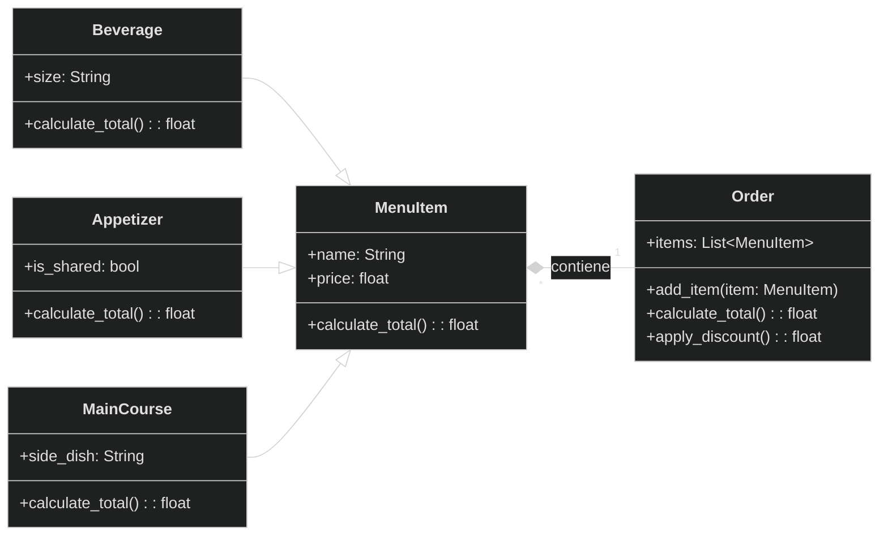

# Reto-03

Este repositorio contiene ejercicios prácticos de POO en Python, documentados y explicados.  

---

## Ejercicio de Clase (`ejercicio_clase.py`)  

`length`, `slope`, `start`, `end`: Atributos de instancia, dos de los cuales son puntos (por lo que una línea se compone al menos de dos puntos).
`compute_length()`: debe devolver la longitud de la línea.
`compute_slope()`: debe devolver la pendiente de la línea desde la horizontal en grados.
`compute_horizontal_cross()`: debe devolver si existe la intersección con el eje x.
`compute_vertical_cross()`: debe devolver si existe la intersección con el eje y.
`Redefinir la clase Rectangle`, añadiendo un nuevo método de inicialización usando 4 líneas (composición óptima: un rectángulo se compone de 4 líneas).

### Código completo

```python
class Point:
    def __init__(self, x: float, y: float) -> None:
        self.x = x
        self.y = y

class Line(Point):
    def __init__(self, start: Point, end: Point ) -> None:
        super().__init__(start.x, start.y)
        self.start = start
        self.end = end

    def compute_length(self) -> float:
        length = ((self.end.x - self.start.x) ** 2 + (self.end.y - self.start.y) ** 2) ** 0.5
        return length
    
    def compute_slope(self):
        # Vertical line
        if (self.end.x - self.start.x) == 0:
            return None  
        slope: float = (self.end.y - self.start.y) / (self.end.x - self.start.x)
        return slope
    
    def compute_vertical_crossing(self):
        # Intersection with y-axis (x=0)
        slope = self.compute_slope()
        if slope is None:
            return None
        crossing = self.start.y - (slope * self.start.x)  # y = mx + b  =>  b = y - mx
        return crossing

    def compute_horizontal_crossing(self):
        # Intersection with x-axis (y=0)
        slope = self.compute_slope()
        if slope == 0:
            return None  # Horizontal line has no crossing with x-axis
        if slope is None:
            return None  # Vertical line has no crossing with x-axis
        crossing = -(self.start.y - (slope * self.start.x)) / slope  # y = mx + b  =>  x = (y - b) / m
        return crossing
    
    def __str__(self) -> str:
        slope = self.compute_slope()
        slope_str = f"{slope:.2f}"
        v_cross = self.compute_vertical_crossing()
        h_cross = self.compute_horizontal_crossing()
        return (
            f"Length: {self.compute_length():.2f}, "
            f"Slope: {slope_str}, "
            f"Vertical crossing: {v_cross}, "
            f"Horizontal crossing: {h_cross}"
        )

class Rectangle:
    def __init__(self, method: int, *args):
        if method == 1:
            # Method 1: Bottom-left + width + height
            bottom_left, width, height = args
            self.width = width
            self.height = height
            self.center = Point(bottom_left.x + width/2, bottom_left.y + height/2)

        elif method == 2:
            # Method 2: Center + width + height
            center, width, height = args
            self.width = width
            self.height = height
            self.center = center

        elif method == 3:
            # Method 3: Two opposite points
            p1, p2 = args
            self.width = abs(p2.x - p1.x)
            self.height = abs(p2.y - p1.y)
            self.center = Point((p1.x + p2.x)/2, (p1.y + p2.y)/2)

        elif method == 4:
            # Method 4: Four lines (composition)
            l1, l2, l3, l4 = args
            lines = [l1, l2, l3, l4]

            points = []
            for line in lines:
                points.append(line.start)
                points.append(line.end)

            xs = []
            ys = []
            for p in points:
                xs.append(p.x)
                ys.append(p.y)

            min_x = min(xs)
            max_x = max(xs)
            min_y = min(ys)
            max_y = max(ys)

            self.width = max_x - min_x
            self.height = max_y - min_y
            self.center = Point((min_x + max_x) / 2, (min_y + max_y) / 2)

        else:
            return "Error: Invalid method"

    def compute_area(self):
        return self.width * self.height

    def compute_perimeter(self):
        return 2 * (self.width + self.height)

    def compute_interference_point(self, point: Point) -> bool:
        x_min = self.center.x - self.width/2
        x_max = self.center.x + self.width/2
        y_min = self.center.y - self.height/2
        y_max = self.center.y + self.height/2
        return x_min <= point.x <= x_max and y_min <= point.y <= y_max


class Square(Rectangle):
    def __init__(self, method: int, *args):
        if method == 1:
            # Method 1: Bottom-left + side
            bottom_left, side = args
            super().__init__(1, bottom_left, side, side)
        elif method == 2:
            # Method 2: Center + side
            center, side = args
            super().__init__(2, center, side, side)
        elif method == 3:
            # Method 3: Two opposite points
            p1, p2 = args
            side = max(abs(p2.x - p1.x), abs(p2.y - p1.y))
            super().__init__(2, Point((p1.x + p2.x) / 2, (p1.y + p2.y) / 2), side, side)
        else:
            raise ValueError("Error: Invalid method")

#Test
p1 = Point(0, 0)
p2 = Point(4, 0)
p3 = Point(4, 3)
p4 = Point(0, 3)

# Create 4 lines that form a rectangle
l1 = Line(p1, p2)
l2 = Line(p2, p3)
l3 = Line(p3, p4)
l4 = Line(p4, p1)

print("Test Rectangle")

# Method 1: Bottom-left + width + height
rect1 = Rectangle(1, Point(0, 0), 4, 3)
print("Method 1 -> Area:", rect1.compute_area(), 
      "Perimeter:", rect1.compute_perimeter(), 
      "Center:", (rect1.center.x, rect1.center.y))

# Method 2: Center + width + height
rect2 = Rectangle(2, Point(2, 1.5), 4, 3)
print("Method 2 -> Area:", rect2.compute_area(), 
      "Perimeter:", rect2.compute_perimeter(), 
      "Center:", (rect2.center.x, rect2.center.y))

# Method 3: Two opposite points
rect3 = Rectangle(3, Point(0, 0), Point(4, 3))
print("Method 3 -> Area:", rect3.compute_area(), 
      "Perimeter:", rect3.compute_perimeter(), 
      "Center:", (rect3.center.x, rect3.center.y))

# Method 4: Four lines
rect4 = Rectangle(4, l1, l2, l3, l4)
print("Method 4 -> Area:", rect4.compute_area(), 
      "Perimeter:", rect4.compute_perimeter(), 
      "Center:", (rect4.center.x, rect4.center.y))

# Test point interference
inside = Point(2, 2)
outside = Point(5, 5)
print("Point (2,2) inside rect4?", rect4.compute_interference_point(inside))
print("Point (5,5) inside rect4?", rect4.compute_interference_point(outside))


print("\nTest Square")

# Method 1: Bottom-left + side
sq1 = Square(1, Point(0, 0), 4)
print("Square Method 1 -> Area:", sq1.compute_area(), 
      "Perimeter:", sq1.compute_perimeter(), 
      "Center:", (sq1.center.x, sq1.center.y))

# Method 2: Center + side
sq2 = Square(2, Point(2, 2), 4)
print("Square Method 2 -> Area:", sq2.compute_area(), 
      "Perimeter:", sq2.compute_perimeter(), 
      "Center:", (sq2.center.x, sq2.center.y))

# Method 3: Two opposite points (will adjust to square)
sq3 = Square(3, Point(0, 0), Point(4, 2))
print("Square Method 3 -> Area:", sq3.compute_area(), 
      "Perimeter:", sq3.compute_perimeter(), 
      "Center:", (sq3.center.x, sq3.center.y))
```
## Reto 03 (`Reto_03.py`)  

### 📖 Enunciado

Escenario de restaurante: Se desea diseñar un programa para calcular la cuenta del pedido de un cliente.
Defina la clase base `MenuItem`: Esta clase debe tener atributos como nombre, precio y un método para calcular el precio total.
Cree subclases para diferentes tipos de elementos del menú: Herede de `MenuItem` y defina propiedades específicas para cada tipo (por ejemplo, `Bebida`, `Aperitivo`, `Plato principal`).
Defina la clase `Orden`: Esta clase debe tener una lista de objetos `MenuItem` y métodos para añadir elementos, calcular el importe total de la cuenta y, potencialmente, aplicar descuentos específicos según la composición del pedido.

---

### 📊 Diagrama de clases  


### Código completo
```python
#Base class for menu items
class MenuItem:
    def __init__(self, name: str, price: float) -> None:
        self.name = name
        self.price = price

    def calculate_total(self) -> float:
        return self.price

    def __str__(self) -> str:
        return f"{self.name} : ${self.calculate_total()}"

#Beverage subclass
class Beverage(MenuItem):
    def __init__(self, name: str, price: float, size: str) -> None:
        super().__init__(name, price)
        self.size = size

    def calculate_total(self) -> float:
        if self.size.lower() == "big":
            return self.price * 1.2 #20% extra for big size
        elif self.size.lower() == "normal":
            return self.price
        elif self.size.lower() == "small": 
            return self.price * 0.8 # 20% discount for small size

#Appetizer subclass
class Appetizer(MenuItem):
    def __init__(self, name: str, price: float, is_shared: bool) -> None:
        super().__init__(name, price)
        self.is_shared = is_shared

    def calculate_total(self) -> float:
        if self.is_shared:
            return self.price * 0.9 # 10% discount for shared appetizers
        return self.price

#MainCourse subclass
class MainCourse(MenuItem):
    def __init__(self, name: str, price: float, side_dish: str) -> None:
        super().__init__(name, price)
        self.side_dish = side_dish

    def calculate_total(self) -> float:
        if self.side_dish.lower() in ["fries", "special salada"]:
            return self.price + 3.0 # Extra cost for special side dishes
        return self.price

class Order:
    def __init__(self) -> None:
        self.items: list = []

    def add_item(self, item: MenuItem) -> None:
        self.items.append(item)

    def calculate_total(self) -> float:
        total = 0
        for item in self.items:
            total += item.calculate_total()
        return total

    def apply_discount(self) -> float:
        total = self.calculate_total()
        if len(self.items) >= 3:
            return total * 0.9 # 10% discount for orders with 3 or more items
        return total

    def __str__(self) -> str:
        text = "--- Pedido ---\n"
        for item in self.items:
            text += f"{item}\n"
        text += f"Total: ${self.apply_discount()}\n"
        return text

# Create menu
#Base class for menu items
class MenuItem:
    def __init__(self, name: str, price: float) -> None:
        self.name = name
        self.price = price

    def calculate_total(self) -> float:
        return self.price

    def __str__(self) -> str:
        return f"{self.name} : ${self.calculate_total()}"

#Beverage subclass
class Beverage(MenuItem):
    def __init__(self, name: str, price: float, size: str) -> None:
        super().__init__(name, price)
        self.size = size

    def calculate_total(self) -> float:
        if self.size.lower() == "big":
            return self.price * 1.2 #20% extra for big size
        elif self.size.lower() == "normal":
            return self.price
        elif self.size.lower() == "small": 
            return self.price * 0.8 # 20% discount for small size

#Appetizer subclass
class Appetizer(MenuItem):
    def __init__(self, name: str, price: float, is_shared: bool) -> None:
        super().__init__(name, price)
        self.is_shared = is_shared

    def calculate_total(self) -> float:
        if self.is_shared:
            return self.price * 0.9 # 10% discount for shared appetizers
        return self.price

#MainCourse subclass
class MainCourse(MenuItem):
    def __init__(self, name: str, price: float, side_dish: str) -> None:
        super().__init__(name, price)
        self.side_dish = side_dish

    def calculate_total(self) -> float:
        if self.side_dish.lower() in ["fries", "special salada"]:
            return self.price + 3.0 # Extra cost for special side dishes
        return self.price

class Order:
    def __init__(self) -> None:
        self.items: list = []

    def add_item(self, item: MenuItem) -> None:
        self.items.append(item)

    def calculate_total(self) -> float:
        total = 0
        for item in self.items:
            total += item.calculate_total()
        return total

    def apply_discount(self) -> float:
        total = self.calculate_total()
        if len(self.items) >= 3:
            return total * 0.9 # 10% discount for orders with 3 or more items
        return total

    def __str__(self) -> str:
        text = "--- Pedido ---\n"
        for item in self.items:
            text += f"{item}\n"
        text += f"Total: ${self.apply_discount()}\n"
        return text

# Create menu
menu = [
    Beverage("Coca-Cola", 5.0, "big"),
    Beverage("Orange juice", 4.0, "normal"),
    Beverage("Mineral water", 2.0, "small"),
    Appetizer("Nachos with cheese", 7.0, True),
    Appetizer("Onion rings", 6.0, False),
    Appetizer("Garlic bread", 4.5, True),
    MainCourse("Hamburger", 12.0, "fries"),
    MainCourse("Margherita pizza", 14.0, "special salad"),
    MainCourse("Bolognese pasta", 11.0, "salad"),
    MainCourse("Grilled chicken", 10.0, "rice")
    ]

# Create an order and add items
order = Order()
order.add_item(menu[0])   # Big Coca-Cola - 20% extra
order.add_item(menu[3])   # Shared Nachos with cheese - 10% discount
order.add_item(menu[6])   # Hamburger with fries - $3 extra
order.add_item(menu[8])   # Pasta with salad - no extra cost

print(order)
```
